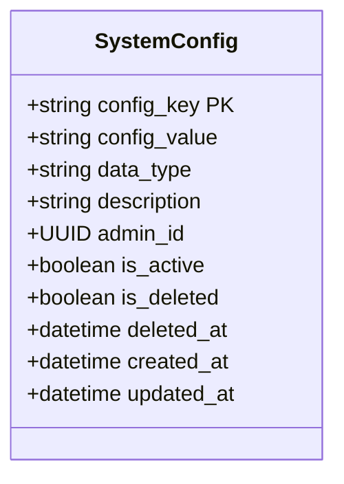
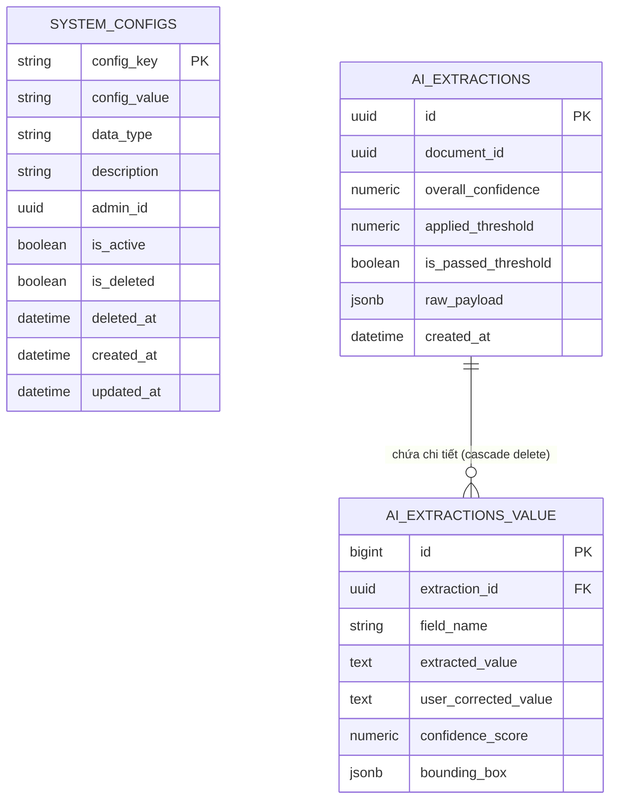

# TÀI LIỆU ĐẶC TẢ KỸ THUẬT & KIẾN TRÚC PHÂN HỆ
## MODULE: OCR HÓA ĐƠN CHI PHÍ & HỆ THỐNG QUẢN TRỊ CẤU HÌNH ĐỘNG (EXPENSE OCR PIPELINE & DYNAMIC SYSTEM CONFIGURATIONS)
**Nhánh phát triển:** `feature/implementation_expenseOcrAndSystemConfigs`  
**Dự án:** TaxKeep VN - Dịch vụ Trí tuệ Nhân tạo Hỗ trợ Thuế TNCN (TaxAIService)  
**Ngày hoàn thiện đặc tả:** 20/09/2026  
**Trạng thái:** Sẵn sàng nghiệm thu / Đã kiểm thử & tích hợp hoàn chỉnh với Backend .NET  

---

### MỤC LỤC
1. [TỔNG QUAN BÀI TOÁN & BỐI CẢNH NGHIỆP VỤ (PROBLEM STATEMENT)](#1-tổng-quan-bài-toán--bối-cảnh-nghiệp-vụ)
2. [KIẾN TRÚC TỔNG THỂ & LUỒNG TÍCH HỢP HỆ THỐNG (SYSTEM ARCHITECTURE)](#2-kiến-trúc-tổng-thể--luồng-tích-hợp-hệ-thống)
3. [ĐẶC TẢ PHÂN HỆ OCR HÓA ĐƠN CHI PHÍ (EXPENSE OCR PIPELINE)](#3-đặc-tả-phân-hệ-ocr-hóa-đơn-chi-phí)
4. [CƠ CHẾ BÓC TÁCH BẢNG HÀNG HÓA & BOUNDING BOX (LINE ITEMS & VISUAL BOXES)](#4-cơ-chế-bóc-tách-bảng-hàng-hóa--bounding-box)
5. [HỆ THỐNG QUẢN TRỊ CẤU HÌNH ĐỘNG (DYNAMIC SYSTEM CONFIG SUBSYSTEM)](#5-hệ-thống-quản-trị-cấu-hình-động)
6. [CƠ CHẾ ĐỐI SOÁT NGƯỠNG 3 TẦNG & KIỂM TRA TRƯỜNG CỐT LÕI (CRUCIAL FIELDS)](#6-cơ-chế-đối-soát-ngưỡng-3-tầng--kiểm-tra-trường-cốt-lõi)
7. [THIẾT KẾ CƠ SỞ DỮ LIỆU & LƯU TRỮ VẾT BÓC TÁCH (AUDIT TRAIL PERSISTENCE)](#7-thiết-kế-cơ-sở-dữ-liệu--lưu-trữ-vết-bóc-tách)
8. [ĐẶC TẢ GIAO DIỆN HÀNG ĐỢI RABBITMQ & REST API](#8-đặc-tả-giao-diện-hàng-đợi-rabbitmq--rest-api)
9. [KẾT LUẬN & GIÁ TRỊ ĐÓNG GÓP CHO ĐỒ ÁN CAPSTONE](#9-kết-luận--giá-trị-đóng-góp-cho-đồ-án-capstone)

---

### 1. TỔNG QUAN BÀI TOÁN & BỐI CẢNH NGHIỆP VỤ

#### 1.1. Bối cảnh Nghiệp vụ Kê khai Chi phí Hợp lý
Trong hệ thống Thuế Thu nhập Cá nhân và quản trị tài chính cá nhân TaxKeep VN, người nộp thuế có quyền kê khai các khoản chi phí hợp lý được trừ (hoặc phục vụ quản lý chi tiêu tài chính) như:
* Hóa đơn viện phí, thuốc men, điều trị y tế (`MEDICAL_EXPENSE_INVOICE`).
* Biên lai, hóa đơn học phí của con em hoặc bản thân (`EDUCATION_FEE_INVOICE`).
* Chứng từ đóng góp từ thiện, nhân đạo, khuyến học (`CHARITY_DONATION_RECEIPT`).
* Phí bảo hiểm nhân thọ, bảo hiểm hưu trí tự nguyện (`INSURANCE_PREMIUM_RECEIPT`).

#### 1.2. Những Thách thức Kỹ thuật
1. **Tính đa dạng & không đồng nhất của chứng từ:** Hóa đơn tại Việt Nam lưu hành dưới dạng hóa đơn điện tử (PDF/ảnh), hóa đơn tự in có bảng chi tiết hàng chục dòng thuốc hoặc viện phí, phiếu thu viết tay.
2. **Nguy cơ tài liệu không hợp lệ / rác:** Người dùng có thể vô tình hoặc cố ý tải lên hóa đơn ăn uống, cà phê, vé xem phim, ảnh rác không liên quan đến chi phí được khấu trừ thuế.
3. **Bài toán bảng chi tiết (Line Items):** Cần bóc tách chính xác danh sách chi tiết hàng hóa/dịch vụ (STT, tên mặt hàng, số lượng, đơn vị, đơn giá, thành tiền) thay vì chỉ đọc mỗi tổng số tiền.
4. **Cấu hình tĩnh (Hardcoded Configurations):** Việc quy định ngưỡng tin cậy (threshold) hay danh sách các trường bắt buộc nếu fix cứng trong mã nguồn sẽ khiến hệ thống thiếu linh hoạt khi chính sách hoặc môi trường kiểm soát rủi ro thay đổi.

#### 1.3. Mục tiêu Triển khai trên nhánh `feature/implementation_expenseOcrAndSystemConfigs`
* Xây dựng pipeline OCR tự động phân loại chứng từ theo danh mục động của Admin, bóc tách đầy đủ thông tin hóa đơn và bảng danh mục hàng hóa chi tiết.
* Xây dựng phân hệ quản trị cấu hình hệ thống động (`system_configs`) với khả năng tự suy đoán kiểu dữ liệu, hỗ trợ Soft Delete và API quản trị thời gian thực.
* Thiết lập cơ chế thẩm định ngưỡng tin cậy 3 tầng linh hoạt kết hợp cơ chế bảo vệ trường cốt lõi (`crucial_fields`).
* Lưu trữ toàn vẹn vết bóc tách (Audit Trail) xuống CSDL gồm bảng cha `ai_extractions` và bảng con `ai_extractions_value` phục vụ đối soát và hiệu chỉnh Human-in-the-loop.

---

### 2. KIẾN TRÚC TỔNG THỂ & LUỒNG TÍCH HỢP HỆ THỐNG

```
┌─────────────────────────────────────────────────────────────────────────┐
│                        TaxKeepVN Core (.NET BE)                         │
│                                                                         │
│  [Expense Controller] ──► [RabbitMQ Publisher]                         │
│                           - Queue: `expense.ocr.ai.request.queue`       │
│                           - Đính kèm: Categories, targetYear, fileUrl   │
└────────────────────────────────────┬────────────────────────────────────┘
                                     │
                                     ▼
┌─────────────────────────────────────────────────────────────────────────┐
│                         TaxAIService (Python)                           │
│                                                                         │
│  [Expense Consumer Worker]                                              │
│  - Tải file từ Cloud/Base64 qua httpx                                   │
│  - Phân tích định dạng MIME                                             │
│                                    │                                    │
│                                    ▼                                    │
│  [ExpenseOcrService] ◄──── [SystemConfigRepository]                     │
│  - Dynamic Prompt Generation       - Đọc THRESHOLD_<CATEGORY>           │
│  - Gemini Multimodal Vision        - Đọc AI_CONFIDENCE_THRESHOLD        │
│  - Structured JSON Output          - Đọc CRUCIAL_FIELDS_<CATEGORY>      │
│                                    │                                    │
│                                    ▼                                    │
│  [Validation & Threshold Engine]                                        │
│  - Kiểm tra docTypeCode vs Categories (Reject if UNSUPPORTED)           │
│  - Kiểm tra extractedYear == targetYear                                 │
│  - Tính overall_confidence & rà soát crucial_fields                     │
│                                    │                                    │
│                                    ▼                                    │
│  [ExpenseOcrRepository] ──► [PostgreSQL: ai_extractions & value]        │
│  - Lưu toàn bộ kết quả bóc tách, bounding box, confidence scores        │
│                                    │                                    │
│                                    ▼                                    │
│  [RabbitMQ Producer] ──────► `expense.ocr.ai.response.queue`            │
└─────────────────────────────────────────────────────────────────────────┘
```

---

### 3. ĐẶC TẢ PHÂN HỆ OCR HÓA ĐƠN CHI PHÍ

#### 3.1. Phân loại Động theo Danh mục của Admin (Dynamic Classification)
Không giới hạn cố định loại chứng từ, Backend .NET truyền danh sách danh mục hiện hành (`AdminCategoryItem`) sang AI:
```python
def build_expense_ocr_prompt(categories: list[AdminCategoryItem]) -> str:
    cat_text = "\n".join([
        f"- Mã '{c.code}': {c.name}. Đặc điểm nhận diện: {c.description}"
        for c in categories
    ])
```
* **Mã `UNSUPPORTED`:** Nếu tài liệu là hóa đơn ăn uống, cà phê, vé xem phim hoặc ảnh rác, AI tự động gán `docTypeCode = "UNSUPPORTED"` kèm lý do chi tiết tại `classificationReason`.

#### 3.2. Cấu trúc Dữ liệu Bóc tách Tổng quát (`GeminiOcrOutput`)
1. **Thông tin Bên bán (Bệnh viện / Cơ sở đào tạo / Nhà cung cấp):**
   * `sellerName`: Tên đơn vị phát hành hóa đơn.
   * `sellerTaxCode`: Mã số thuế bên bán (rất quan trọng để tra cứu tính hợp lệ).
   * `sellerAddress`, `sellerPhone`.
2. **Thông tin Hóa đơn & Tra cứu:**
   * `invoiceSeries`: Ký hiệu mẫu hóa đơn (ví dụ: `2C26TBH`).
   * `invoiceNumber`: Số hóa đơn (ví dụ: `82621`).
   * `invoiceDate`: Ngày lập hóa đơn dạng `YYYY-MM-DD`.
   * `extractedYear`: Năm trích xuất từ ngày lập (dùng để đối soát với năm quyết toán).
   * `lookupUrl`, `lookupCode`: Đường dẫn và mã tra cứu hóa đơn điện tử.
3. **Thông tin Bên mua (Bệnh nhân / Học sinh / Người nộp thuế):**
   * `buyerName`: Họ tên người mua / bệnh nhân / học sinh.
   * `buyerIdCard`: Số CCCD/CMND.
   * `buyerAddress`, `buyerTaxCode`, `paymentMethod`.
4. **Thông tin Tài chính:**
   * `totalAmount`: Tổng số tiền thanh toán dạng số thực (`float`).
   * `totalAmountInWords`: Số tiền viết bằng chữ.

---

### 4. CƠ CHẾ BÓC TÁCH BẢNG HÀNG HÓA & BOUNDING BOX

#### 4.1. Bóc tách Bảng Chi tiết Hàng hóa / Viện phí (`InvoiceLineItem`)
Phân hệ trích xuất toàn bộ bảng dịch vụ vào mảng `items`:
```json
{
  "items": [
    {
      "itemOrder": 1,
      "itemName": "Khám chuyên khoa Nhi",
      "unit": "Lần",
      "quantity": 1.0,
      "unitPrice": 250000.0,
      "totalPrice": 250000.0
    },
    {
      "itemOrder": 2,
      "itemName": "Thuốc Amoxicillin 500mg",
      "unit": "Hộp",
      "quantity": 2.0,
      "unitPrice": 85000.0,
      "totalPrice": 170000.0
    }
  ]
}
```

#### 4.2. Tọa độ Trực quan (Bounding Box) & Điểm Tin cậy Trường
Để hỗ trợ giao diện Frontend vẽ khung sáng làm nổi bật vị trí chữ được đọc trên hóa đơn, mỗi trường trong danh sách `fields` trả về:
* `fieldName`: Tên trường dữ liệu.
* `extractedValue`: Giá trị văn bản đọc được.
* `confidenceScore`: Độ tin cậy ($0.0 \rightarrow 1.0$).
* `boundingBox`: Tọa độ hình chữ nhật `{"x": int, "y": int, "w": int, "h": int}` trên ảnh gốc.

---

### 5. HỆ THỐNG QUẢN TRỊ CẤU HÌNH ĐỘNG (DYNAMIC SYSTEM CONFIG SUBSYSTEM)

#### 5.1. Mô hình Dữ liệu Bảng `system_configs`


#### 5.2. Thuật toán Tự động Suy đoán Kiểu Dữ liệu (`_detect_data_type`)
Admin có thể tạo cấu hình mới mà không cần chọn thủ công kiểu dữ liệu; hệ thống tự động suy đoán:
* `true`, `false` $\rightarrow$ `ConfigDataType.BOOLEAN`.
* Số nguyên nguyên thủy $\rightarrow$ `ConfigDataType.INT`.
* Số có phần thập phân (`0.85` hoặc `0,85`) $\rightarrow$ `ConfigDataType.FLOAT` (tự động chuẩn hóa dấu phẩy thành dấu chấm).
* Chuỗi bắt đầu và kết thúc bằng `{...}` hoặc `[...]` $\rightarrow$ `ConfigDataType.JSON`.
* Chuỗi chứa dấu phẩy $\rightarrow$ `ConfigDataType.LIST_STRING`.
* Còn lại $\rightarrow$ `ConfigDataType.STRING`.

#### 5.3. Cơ chế Xóa mềm (Soft Delete)
Khi Admin xóa cấu hình qua `DELETE /api/system-configs/{key}`, hệ thống không xóa vật lý mà cập nhật `is_deleted = True` và `deleted_at = func.now()`. Điều này đảm bảo tính toàn vẹn dữ liệu cho các lần bóc tách lịch sử.

---

### 6. CƠ CHẾ ĐỐI SOÁT NGƯỠNG 3 TẦNG & KIỂM TRA TRƯỜNG CỐT LÕI

#### 6.1. Quy trình Phân giải Ngưỡng Tin cậy (Threshold Resolution)
Ngưỡng tin cậy áp dụng (`applied_threshold`) được phân giải tự động theo 3 tầng:
1. **Tầng 1 (Ngưỡng riêng theo danh mục):** Ví dụ Admin cấu hình `THRESHOLD_MEDICAL_EXPENSE_INVOICE = 0.85`. Khi xử lý hóa đơn y tế, hệ thống ưu tiên áp dụng ngưỡng này.
2. **Tầng 2 (Ngưỡng chung toàn hệ thống):** Nếu danh mục không có ngưỡng riêng, hệ thống đọc khóa `AI_CONFIDENCE_THRESHOLD`.
3. **Tầng 3 (Mặc định dự phòng):** Nếu không tìm thấy khóa nào trong CSDL, hệ thống sử dụng giá trị an toàn `0.80`.

#### 6.2. Thuật toán Tính Điểm Tin cậy Tổng thể (`overall_confidence`)
$$\text{Overall Confidence} = \text{round}\left(\frac{\sum_{i=1}^{M} \text{FieldConfidence}_i}{M}, 2\right)$$
*(Với $M$ là tổng số lượng các trường dữ liệu bóc tách được trong mảng `fields`).*

#### 6.3. Cơ chế Bảo vệ Trường Cốt lõi (Crucial Fields Enforcement)
* Hệ thống truy vấn danh sách trường cốt lõi từ khóa `CRUCIAL_FIELDS_<CATEGORY>` hoặc `CRUCIAL_EXTRACTION_FIELDS` (mặc định gồm: `total_amount`, `seller_tax_code`, `buyer_id_card`, `invoice_number`).
* **Quy tắc an toàn nghiêm ngặt:** Kể cả khi `overall_confidence >= applied_threshold`, nhưng nếu **chỉ cần 1 trường cốt lõi** có `confidenceScore < applied_threshold`:
  $$\text{has\_crucial\_low\_confidence} = \text{True} \implies \text{is\_passed\_threshold} = \text{False}$$
* Hệ thống lập tức đánh dấu không đạt ngưỡng và yêu cầu xác nhận thủ công (Human-in-the-loop) để ngăn chặn rủi ro gian lận tiền thuế hoặc sai lệch mã số thuế.

---

### 7. THIẾT KẾ CƠ SỞ DỮ LIỆU & LƯU TRỮ VẾT BÓC TÁCH

#### 7.1. Sơ đồ Thực thể Quan hệ (ERD)



#### 7.2. Ý nghĩa Kiến trúc của 2 Bảng `ai_extractions` & `ai_extractions_value`
* **`ai_extractions` (Bảng cha):** Lưu vết tổng thể của phiên bóc tách: ID tài liệu, điểm tổng quan, ngưỡng áp dụng, cờ đạt ngưỡng và toàn bộ JSON thô do Gemini sinh ra (`raw_payload`).
* **`ai_extractions_value` (Bảng con):** Lưu chi tiết từng trường bóc tách, tọa độ Bounding Box, điểm tin cậy và đặc biệt là cột `user_corrected_value`. Khi người dùng sửa lại thông tin sai trên giao diện, giá trị mới được lưu vào cột này, tạo tập dữ liệu quý giá phục vụ đánh giá mô hình và fine-tuning trong tương lai.

---

### 8. ĐẶC TẢ GIAO DIỆN HÀNG ĐỢI RABBITMQ & REST API

#### 8.1. Hàng đợi RabbitMQ (`expense.ocr.ai.request.queue` & `response.queue`)

##### Request Message từ Backend .NET:
```json
{
  "taskId": "a1b2c3d4-e5f6-7a8b-9c0d-1e2f3a4b5c6d",
  "periodId": "b2c3d4e5-f6a7-8b9c-0d1e-2f3a4b5c6d7e",
  "userId": "c3d4e5f6-a7b8-9c0d-1e2f-3a4b5c6d7e8f",
  "targetYear": 2026,
  "fileUrl": "https://storage.taxkeep.vn/expenses/vienphi_2026.jpg",
  "originalFilename": "vienphi_2026.jpg",
  "categories": [
    {
      "code": "MEDICAL_EXPENSE_INVOICE",
      "name": "Hóa đơn viện phí y tế",
      "description": "Hóa đơn khám chữa bệnh, viện phí, tiền thuốc tại bệnh viện/phòng khám"
    }
  ],
  "appliedThreshold": 0.85
}
```

##### Response Message trả về Backend .NET:
```json
{
  "id": "a1b2c3d4-e5f6-7a8b-9c0d-1e2f3a4b5c6d",
  "periodId": "b2c3d4e5-f6a7-8b9c-0d1e-2f3a4b5c6d7e",
  "userId": "c3d4e5f6-a7b8-9c0d-1e2f-3a4b5c6d7e8f",
  "docTypeCode": "MEDICAL_EXPENSE_INVOICE",
  "fileUrl": "https://storage.taxkeep.vn/expenses/vienphi_2026.jpg",
  "originalFilename": "vienphi_2026.jpg",
  "invoiceSeries": "2C26TBH",
  "invoiceNumber": "0082621",
  "invoiceDate": "2026-03-15",
  "extractedYear": 2026,
  "sellerName": "BỆNH VIỆN ĐẠI HỌC Y DƯỢC TP.HCM",
  "sellerTaxCode": "0302221111",
  "buyerName": "NGUYỄN VĂN AN",
  "totalAmount": 1250000.0,
  "totalAmountInWords": "Một triệu hai trăm năm mươi nghìn đồng",
  "items": [
    {
      "itemOrder": 1,
      "itemName": "Khám bệnh chuyên khoa",
      "unit": "Lần",
      "quantity": 1.0,
      "unitPrice": 250000.0,
      "totalPrice": 250000.0
    }
  ],
  "validationStatus": {
    "isYearValid": true,
    "isDocTypeValid": true,
    "isIdentityValid": true
  },
  "validationErrors": [],
  "status": "EXTRACTED",
  "createdAt": "2026-09-20T15:30:00Z"
}
```

#### 8.2. RESTful API Quản trị Cấu hình Hệ thống (`/api/system-configs`)

| STT | Phương thức | Endpoint | Mô tả | Quyền |
| :--- | :--- | :--- | :--- | :--- |
| 1 | `GET` | `/api/system-configs` | Lấy danh sách cấu hình hệ thống (hỗ trợ lọc `active_only`) | Admin |
| 2 | `POST` | `/api/system-configs` | Tạo cấu hình / ngưỡng mới (tự suy đoán kiểu dữ liệu) | Admin |
| 3 | `GET` | `/api/system-configs/{key}` | Xem chi tiết cấu hình theo khóa | Admin |
| 4 | `PUT` | `/api/system-configs/{key}` | Cập nhật giá trị, kiểu dữ liệu hoặc bật/tắt cấu hình | Admin |
| 5 | `DELETE` | `/api/system-configs/{key}` | Xóa mềm cấu hình hệ thống | Admin |
| 6 | `GET` | `/api/system-configs/threshold/test-resolve` | Kiểm tra trực quan xem danh mục cụ thể sẽ áp dụng ngưỡng nào | Admin/Tester |

---

### 9. KẾT LUẬN & GIÁ TRỊ ĐÓNG GÓP CHO ĐỒ ÁN CAPSTONE

1. **Khả năng thương mại hóa cao:** Phân hệ xử lý trọn vẹn bài toán bóc tách hóa đơn tài chính phức tạp, bao gồm cả các bảng kê hàng hóa nhiều dòng, tự động loại bỏ hóa đơn không hợp lệ (`UNSUPPORTED`).
2. **Kiến trúc phần mềm linh hoạt (Zero Hardcode):** Toàn bộ ngưỡng tin cậy, quy tắc trường cốt lõi và danh mục chứng từ đều được điều khiển động từ CSDL qua hệ thống `system_configs`.
3. **Quản trị rủi ro & An toàn dữ liệu tài chính:** Mô hình kết hợp giữa điểm tin cậy tổng thể, kiểm soát trường cốt lõi và Bounding Box trực quan tạo tiền đề vững chắc cho quy trình kiểm toán và hậu kiểm của cơ quan thuế.
