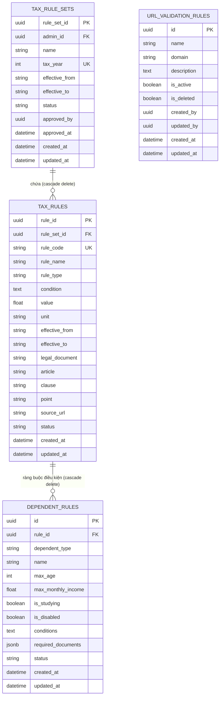

# TÀI LIỆU ĐẶC TẢ KỸ THUẬT & KIẾN TRÚC PHÂN HỆ
## MODULE: UPLOAD VĂN BẢN QUY TẮC THUẾ & TRÍCH XUẤT TỰ ĐỘNG BẰNG AI (TAX RULE DOCUMENT AI EXTRACTION)
**Nhánh phát triển:** `feature/implemation_UploadTaxRuleDocumentByAIExtraction`  
**Dự án:** TaxKeep VN - Dịch vụ Trí tuệ Nhân tạo Hỗ trợ Thuế TNCN (TaxAIService)
**Ngày Bắt Đầu đặc tả:** 09/09/2026    
**Ngày hoàn thiện đặc tả:** 20/09/2026  
**Trạng thái:** Sẵn sàng nghiệm thu / Đã kiểm thử tự động  

---

### MỤC LỤC
1. [TỔNG QUAN BÀI TOÁN & MỤC TIÊU NGHIÊN CỨU (PROBLEM STATEMENT)](#1-tổng-quan-bài-toán--mục-tiêu-nghiên-cứu)
2. [ĐẶC TẢ YÊU CẦU NGHIỆP VỤ & PHẠM VI (BUSINESS REQUIREMENTS & SCOPE)](#2-đặc-tả-yêu-cầu-nghiệp-vụ--phạm-vi)
3. [KIẾN TRÚC HỆ THỐNG & NGUYÊN LÝ THIẾT KẾ (SYSTEM ARCHITECTURE)](#3-kiến-trúc-hệ-thống--nguyên-lý-thiết-kế)
4. [ĐẶC TẢ CHI TIẾT CÁC TÍNH NĂNG ĐÃ TRIỂN KHAI (DETAILED FEATURES)](#4-đặc-tả-chi-tiết-các-tính-năng-đã-triển-khai)
   * [4.6. Ma trận kiểm soát & Thẩm định toàn diện (Comprehensive Validation Matrix)](#46-ma-trận-kiểm-soát--thẩm-định-toàn-diện-comprehensive-validation--error-handling-matrix)
5. [THIẾT KẾ DỮ LIỆU & QUAN HỆ THỰC THỂ (DATABASE & DATA MODELING)](#5-thiết-kế-dữ-liệu--quan-hệ-thực-thể)
   * [5.3. Chuẩn hóa an toàn kiểu dữ liệu bằng hệ thống Enum (`app.enum`)](#53-chuẩn-hóa-an-toàn-kiểu-dữ-liệu-bằng-hệ-thống-enum-appenum)
6. [KỸ THUẬT XỬ LÝ AI & PROMPT ENGINEERING PROTOCOL](#6-kỹ-thuật-xử-lý-ai--prompt-engineering-protocol)
7. [ĐẶC TẢ GIAO DIỆN LẬP TRÌNH (API & MESSAGING SPECIFICATION)](#7-đặc-tả-giao-diện-lập-trình)
8. [CHIẾN LƯỢC ĐẢM BẢO CHẤT LƯỢNG & KIỂM THỬ (TESTING & VERIFICATION)](#8-chiến-lược-đảm-bảo-chất-lượng--kiểm-thử)
9. [KẾT LUẬN & ĐÓNG GÓP HỌC THUẬT CỦA PHÂN HỆ](#9-kết-luận--đóng-góp-học-thuật)

---

### 1. TỔNG QUAN BÀI TOÁN & MỤC TIÊU NGHIÊN CỨU

#### 1.1. Bối cảnh thực tiễn (Practical Context)
Hệ thống chính sách và văn bản pháp luật về Thuế Thu nhập Cá nhân (TNCN) tại Việt Nam thường xuyên được sửa đổi, bổ sung và điều chỉnh theo lộ trình phát triển kinh tế:
* Mức giảm trừ gia cảnh (bản thân người nộp thuế, người phụ thuộc) thay đổi theo các Nghị quyết của Ủy ban Thường vụ Quốc hội (như Nghị quyết 954/2020/UBTVQH14, và các dự thảo điều chỉnh biểu thuế mới).
* Biểu thuế lũy tiến từng phần, các mức giảm trừ bảo hiểm bắt buộc, đóng góp từ thiện, và các khoản phụ cấp miễn thuế gắn với tiền lương có các điều kiện ràng buộc pháp lý phức tạp.

#### 1.2. Hạn chế của các hệ thống tính thuế truyền thống (Traditional Bottlenecks)
1. **Hardcoded Rules:** Đa số các phần mềm kế toán hoặc công cụ tính thuế hiện nay cài đặt cứng các con số và bậc thuế trực tiếp vào mã nguồn. Khi luật thay đổi, lập trình viên phải sửa code, test lại toàn bộ và deploy phiên bản mới, tiềm ẩn rủi ro sai sót rất lớn.
2. **Thao tác nhập liệu thủ công (Manual Data Entry):** Quản trị viên phải tự đọc các văn bản quy phạm pháp luật dài hàng chục trang, tự bóc tách từng con số, từng điều kiện rồi gõ tay vào hệ thống quản trị. Quá trình này tốn thời gian và dễ nhầm lẫn giữa các năm tính thuế.
3. **Thách thức về thể thức văn bản:** Các văn bản pháp luật ban hành tại Việt Nam thường lưu hành dưới 2 dạng: PDF có text layer và PDF bản scan (ảnh chụp có con dấu đỏ, chữ ký). Các giải pháp OCR thông thường (như Tesseract) gặp khó khăn khi trích xuất ngữ cảnh pháp lý và bảng biểu phức tạp.

#### 1.3. Mục tiêu của phân hệ (Module Objectives)
Phân hệ **Upload Tax Rule Document By AI Extraction** được nghiên cứu và hiện thực hóa nhằm:
* Cho phép Quản trị viên (Admin) tải lên trực tiếp văn bản pháp luật (file PDF).
* Ứng dụng mô hình ngôn ngữ lớn đa thể thức (Gemini LLM / Multimodal Vision) để tự động đọc, hiểu ngữ cảnh pháp lý và trích xuất thành bộ quy tắc thuế chuẩn hóa (`TaxRuleSet`, `TaxRule`, `DependentRule`).
* Cung cấp cơ chế đối soát năm áp dụng (Tax Year Verification) và cảnh báo lệch năm tự động.
* Thiết lập quy trình **Human-in-the-loop**: AI trích xuất  Lưu bản nháp (Draft)  Admin rà soát, hiệu chỉnh  Phê duyệt (Approve) chuyển sang trạng thái chính thức (Active) phục vụ công cụ tính thuế.

---

### 2. ĐẶC TẢ YÊU CẦU NGHIỆP VỤ & PHẠM VI

#### 2.1. Phạm vi nghiệp vụ bắt buộc (Scope Constraints)
* **TẬP TRUNG CHUYÊN BIỆT:** Chỉ trích xuất các quy tắc thuế trực tiếp áp dụng cho **Thu nhập từ tiền lương, tiền công (Employment Income / Salary & Wages)** của cá nhân cư trú và cá nhân không cư trú.
* **LOẠI TRỪ TUYỆT ĐỐI (Out of Scope):**
  * Không trích xuất các quy tắc liên quan đến thu nhập từ kinh doanh (Business Income, hộ kinh doanh).
  * Không trích xuất các nguồn thu nhập khác: chuyển nhượng bất động sản, chuyển nhượng vốn, chứng khoán, đầu tư vốn (cổ tức, lợi tức), trúng thưởng, bản quyền, nhượng quyền thương mại, thừa kế, quà tặng.

#### 2.2. Danh mục quy tắc thuế cần trích xuất (Tax Rule Taxonomy)
Hệ thống phân loại quy tắc thuế thành 4 nhóm chính:
1. **Nhóm Giảm trừ (Rule Type: `DEDUCTION`):**
   * `PIT_DEDUCTION_PERSONAL`: Mức giảm trừ cho bản thân người nộp thuế (VND/tháng).
   * `PIT_DEDUCTION_DEPENDENT`: Mức giảm trừ cho người phụ thuộc (VND/người/tháng) kèm bộ tiêu chí chi tiết theo từng nhóm đối tượng (Con dưới 18 tuổi, Con thành niên đang học/khuyết tật, Vợ/chồng, Cha mẹ, Người phụ thuộc khác).
   * `PIT_DEDUCTION_INSURANCE`: Các khoản bảo hiểm bắt buộc trừ vào lương (BHXH, BHYT, BHTN).
   * `PIT_DEDUCTION_CHARITY`: Các khoản đóng góp từ thiện, nhân đạo, khuyến học.
2. **Nhóm Biểu thuế lũy tiến từng phần (Rule Type: `BRACKET`):**
   * Các bậc thuế từ Bậc 1 đến Bậc 7 (`PIT_BRACKET_1` $\rightarrow$ `PIT_BRACKET_7`), bao gồm ngưỡng thu nhập tính thuế theo tháng/năm và thuế suất tương ứng (5%, 10%, 15%, 20%, 25%, 30%, 35%).
3. **Nhóm Thuế suất đặc thù (Rule Type: `RATE`):**
   * `PIT_RATE_NON_RESIDENT_SALARY`: Thuế suất tiền lương cá nhân không cư trú (20%).
   * `PIT_RATE_CASUAL_SALARY`: Thuế suất khấu trừ tại nguồn đối với lao động thời vụ / hợp đồng dưới 3 tháng có thu nhập từ 2 triệu đồng/lần trở lên (10%).
4. **Nhóm Miễn thuế (Rule Type: `EXEMPTION`):**
   * `PIT_EXEMPTION_OVERTIME`: Thu nhập từ phần tiền lương làm việc ban đêm, làm thêm giờ được trả cao hơn.
   * `PIT_EXEMPTION_RETIREMENT_PENSION`: Lương hưu do Quỹ BHXH chi trả.
   * `PIT_EXEMPTION_INSURANCE_COMPENSATION`: Tiền trợ cấp tai nạn lao động, bồi thường bảo hiểm.

---

### 3. KIẾN TRÚC HỆ THỐNG & NGUYÊN LÝ THIẾT KẾ

#### 3.1. Sơ đồ kiến trúc tổng thể (Architectural Overview)

```
[ Admin Web Client / BE.Net Core ]
             │
   ┌─────────┴─────────┐
   │ (REST API Upload) │ (RabbitMQ Message)
   ▼                   ▼
┌────────────────────────────────────────────────────────┐
│               TaxAIService (FastAPI)                   │
│                                                        │
│  [API Routes]                 [RabbitMQ Consumer]      │
│  /api/tax-rules/upload         tax.ai.request.queue    │
│            │                             │             │
│            └──────────────┬──────────────┘             │
│                           ▼                            │
│              [TaxRuleDocumentService]                  │
│                           │                            │
│       ┌───────────────────┼───────────────────┐        │
│       ▼                   ▼                   ▼        │
│ [UrlValidation]     [PDFService]    [TaxRuleExtract]  │
│  Whitelist check    Hybrid PyMuPDF     Gemini LLM      │
│                     & Scan bytes       Structured JSON │
│                           │                   │        │
│                           └─────────┬─────────┘        │
│                                     ▼                  │
│                           [TaxRuleMapper]              │
│                                     ▼                  │
│                         [TaxRuleRepository]            │
│                                     ▼                  │
│                     [PostgreSQL / pgvector]            │
└────────────────────────────────────────────────────────┘
```

#### 3.2. Các mẫu thiết kế ứng dụng (Design Patterns Applied)
1. **Clean Layered Architecture (Kiến trúc phân lớp sạch):**
   * `Routes Layer`: Tiếp nhận request, thẩm định đầu vào HTTP/Form-data, trả về status code chuẩn RESTful.
   * `Messaging Layer`: Độc lập hóa Consumer/Producer xử lý thông điệp bất đồng bộ.
   * `Service Layer`: Chứa toàn bộ nghiệp vụ xử lý tài liệu, điều phối AI và thẩm định nguồn gốc. Giao tiếp qua Interface (`ITaxRuleService`).
   * `Repository Layer`: Trừu tượng hóa truy cập CSDL, triển khai mẫu Repository Pattern (`ITaxRuleRepository`).
   * `Mapper Layer`: Đảm bảo tính toàn vẹn khi chuyển đổi từ kết quả trích xuất JSON phi cấu trúc sang các ORM Entities có quan hệ ràng buộc.
2. **Hybrid Ingestion Pattern (Xử lý tài liệu lai):** Tối ưu hóa giữa hiệu năng phân tích text vector và năng lực thị giác đa thể thức (Multimodal Vision) dựa trên thuộc tính vật lý của file PDF.
3. **Event-Driven Asynchronous Processing:** Tích hợp RabbitMQ để tách rời (decouple) quá trình upload tốn thời gian giữa Web Backend và AI Service, chống nghẽn hệ thống.

---

### 4. ĐẶC TẢ CHI TIẾT CÁC TÍNH NĂNG ĐÃ TRIỂN KHAI

#### 4.1. Phân loại & Tiền xử lý PDF thông minh (`pdf_service.py`)
* **Thuật toán kiểm tra trang scan:** Hệ thống duyệt từng trang của file PDF bằng thư viện `PyMuPDF (fitz)`. Nếu độ dài ký tự trích xuất trên một trang nhỏ hơn 15 ký tự, trang đó được đánh dấu là "Trang scan/ảnh chụp hoặc trang trống".
* **Xử lý hai nhánh:**
  * *Trường hợp 1 (100% trang là Text):* Trích xuất toàn văn bản kèm chỉ mục số trang dạng `--- [Trang X] ---` và gửi sang Gemini qua Text Prompt. Tiết kiệm băng thông và tăng tốc độ xử lý lên gấp 4 lần.
  * *Trường hợp 2 (Có trang scan hoặc file hỗn hợp):* Tự động cắt tách tối đa 30 trang tài liệu liên quan, biên dịch thành luồng nhị phân `sample_bytes` và đóng gói thành `types.Part.from_bytes(mime_type="application/pdf")` để đưa vào Gemini Multimodal Vision API.

#### 4.2. Thẩm định URL nguồn tài liệu bằng Whitelist động (`url_validation_service.py`)
* Để ngăn chặn việc nhập các văn bản giả mạo hoặc nguồn không chính thống, hệ thống kiểm tra trường `sourceUrl` của văn bản tải lên.
* **Cơ chế chuẩn hóa:** Tự động loại bỏ tiền tố giao thức (`http://`, `https://`), bỏ `www.` và các path/query phía sau để lấy domain gốc.
* **Quy tắc khớp (Domain Matching):** Chấp nhận khớp chính xác domain hoặc khớp subdomain (ví dụ: nguồn `vanban.chinhphu.vn` tự động hợp lệ nếu hệ thống đã cấu hình cho phép `chinhphu.vn`).
* Cung cấp trọn bộ REST API quản lý cấu hình danh sách domain cho Admin (`/api/url-rules`).

#### 4.3. Cơ chế đối soát năm tính thuế (Tax Year Verification Protocol)
* **Vấn đề giải quyết:** Admin có thể nhập nhầm năm tính thuế (ví dụ: nhập năm 2026 nhưng tải lên văn bản ban hành cho năm 2020).
* **Quy trình xử lý của AI:**
  1. AI phân tích tiêu đề, ngày ký ban hành và điều khoản hiệu lực thi hành để bóc tách `extractedTaxYear`.
  2. So sánh `extractedTaxYear` với `inputTaxYear`.
  3. Xuất cờ `isTaxYearMatched` và mô tả cụ thể `mismatchReason`.
* **Chỉ thị xử lý đặc biệt (Non-blocking Extraction):** Dù năm không khớp, AI **vẫn bắt buộc trích xuất toàn bộ các quy tắc thuế** có trong tài liệu và hệ thống vẫn lưu trữ dưới dạng Draft kèm thông điệp `warning`. Điều này giúp Admin không bị mất dữ liệu bóc tách và có thể chủ động sửa lại năm áp dụng qua API hiệu chỉnh.

#### 4.4. Tích hợp RabbitMQ xử lý hàng đợi bất đồng bộ (`messaging`)
* Khởi chạy nền với vòng lặp tự phục hồi kết nối (`retry_interval = 5s`).
* Nhận thông điệp từ `tax.ai.request.queue`, hỗ trợ linh hoạt 3 phương thức cung cấp tài liệu:
  1. `file_base64`: Chuỗi base64 của file PDF.
  2. `file_url`: Tải trực tiếp file qua HTTP/HTTPS sử dụng `httpx.AsyncClient`.
  3. `file_path`: Đọc file từ đường dẫn lưu trữ nội bộ.
* Sau khi xử lý xong, xuất bản (publish) thông điệp kết quả sang `tax.ai.response.queue` kèm `task_id`, `admin_id`, trạng thái `SUCCESS`/`FAILED`, `rule_set_id`, `warning` và chi tiết toàn bộ dữ liệu đã bóc tách.

#### 4.5. Quản lý vòng đời bộ luật thuế (Tax Rule Lifecycle)
* **Trạng thái Draft (Nháp):** Khi AI vừa bóc tách xong, toàn bộ `TaxRuleSet`, `TaxRule` và `DependentRule` được lưu ở trạng thái Draft.
* **Human-in-the-loop Editing:** Admin có thể gọi `GET /api/tax-rules/{id}` để rà soát toàn bộ chi tiết và `PUT /api/tax-rules/{id}` để cập nhật lại tên, năm, căn cứ pháp lý, giá trị nếu cần.
* **Approve:** Khi Admin xác nhận bộ luật chính xác, gọi `POST /api/tax-rules/{id}/approve`, hệ thống cập nhật `status = Active`, ghi nhận `approved_by` và `approved_at`.

#### 4.6. Ma trận kiểm soát & Thẩm định toàn diện (Comprehensive Validation & Error Handling Matrix)
Toàn bộ luồng Upload, trích xuất AI, cập nhật và phê duyệt tuân thủ chặt chẽ mô hình thẩm định đa tầng (Multi-layered Defense Validation), bảo đảm an toàn dữ liệu, tính chính xác pháp lý và tính bất biến của bộ luật khi đã ban hành:

| STT | Tầng thẩm định (Validation Layer) | Đối tượng / Trường kiểm tra | Điều kiện ràng buộc hợp lệ | Mã phản hồi HTTP / Exception | Thông báo lỗi chuẩn hóa (Standard Error Message) |
| :---: | :--- | :--- | :--- | :---: | :--- |
| **1** | **HTTP Form-data** | `file` | Bắt buộc đính kèm tệp tin và tên tệp tin không được để trống | `400 Bad Request` | `{"message": "The file field is required."}` |
| **2** | **HTTP Form-data** | `file.filename` | Định dạng mở rộng tệp tin bắt buộc phải là `.pdf` (không phân biệt hoa/thường) | `400 Bad Request` | `{"message": "The file must be a PDF."}` |
| **3** | **HTTP Form-data** | `file_bytes` | Dung lượng tệp tin tải lên không vượt quá 20MB (`len(file_bytes) <= MAX_FILE_SIZE_MB * 1024 * 1024`) | `400 Bad Request` | `{"message": "The file size must not exceed 20 MB."}` |
| **4** | **HTTP Form-data** | `taxYear` | Bắt buộc phải có giá trị (không rỗng, không whitespace) | `400 Bad Request` | `{"TaxYear": "The TaxYear field is required."}` |
| **5** | **HTTP Form-data** | `taxYear` | Bắt buộc là số nguyên 4 chữ số hợp lệ nằm trong khoảng `[1900, 2100]` | `400 Bad Request` | `{"message": "Tax year must be a valid year."}` |
| **6** | **HTTP Form-data** | `sourceUrl` (nếu có) | URL phải bắt đầu bằng `http://` hoặc `https://`. Tên miền gốc phải thuộc Danh sách Whitelist đang kích hoạt (`url_validation_rules`) | `400 Bad Request` | `{"SourceUrl": "The SourceUrl is not allowed by active URL validation rules."}` |
| **7** | **HTTP Form-data** | `adminId` (nếu có) | Phải là chuỗi định dạng định danh toàn cầu UUID chuẩn (RFC 4122) | `400 Bad Request` | `{"message": "adminId must be a valid UUID."}` |
| **8** | **PDF Physical Layer** | Cấu trúc tệp PDF | Tệp PDF nguyên vẹn, giải mã được qua `pymupdf.open()` | `400 Bad Request` | `"Cannot open PDF file: {detail}"` |
| **9** | **PDF Physical Layer** | Nội dung trang PDF | Tổng số trang $> 0$ và văn bản có nội dung bóc tách được (`len(doc) > 0`) | `400 Bad Request` | `"PDF does not contain extractable text."` |
| **10** | **Database Uniqueness** | Năm tính thuế (`tax_year`) | Bảng `tax_rule_sets` chưa tồn tại bản ghi nào có cùng `tax_year` (Ràng buộc Unique Constraint) | `409 Conflict` | `"A tax rule set for this tax year already exists."` |
| **11** | **Database Uniqueness** | Mã quy tắc thuế (`ruleCode`) | Không được trùng bất kỳ mã `ruleCode` nào đã tồn tại trong CSDL (`check_existing_rule_codes`) | `409 Conflict` | `"The rule code already exists."` |
| **12** | **AI Extraction Layer** | Cấu trúc dữ liệu AI | Gemini LLM phải phản hồi chuỗi JSON hợp lệ và trích xuất được ít nhất 1 quy tắc thuế | `400 Bad Request` | `"No tax rule information could be extracted from the document."` |
| **13** | **AI Verification Layer** | Đối soát năm áp dụng (`verification`) | So khớp `extractedTaxYear` và `inputTaxYear`. **Non-blocking Policy:** Nếu lệch năm, sinh cảnh báo nhưng **vẫn lưu bản nháp** để Admin hiệu chỉnh | `200 OK` *(kèm Warning)* | `"Năm áp dụng trong văn bản ({doc_year}) không khớp với năm tính thuế nhập vào ({input_year}). Chi tiết: {reason}"` |
| **14** | **Rule Lifecycle (Update)** | Tính bất biến khi duyệt (`status`) | **Quy tắc bất biến:** Nghiêm cấm chỉnh sửa (`PUT`) bất kỳ thông tin nào khi bộ quy tắc đã được phê duyệt (`status == "Active"`) | `400 Bad Request` | `"Cannot update tax rule set because it has already been approved and is active."` |
| **15** | **Rule Lifecycle (Update)** | Đổi năm áp dụng khi sửa | Khi sửa `tax_year`, năm mới không được trùng với bất kỳ `TaxRuleSet` nào khác trong hệ thống | `409 Conflict` | `"A tax rule set for this tax year already exists."` |
| **16** | **Rule Lifecycle (Update/Approve)** | Tồn tại của thực thể | Bộ quy tắc thuế theo ID (`rule_set_id`) phải tồn tại trong CSDL | `404 Not Found` | `"Tax rule set not found."` |
| **17** | **RabbitMQ Messaging** | Nguồn cung cấp tệp tin | Bắt buộc phải có ít nhất 1 trong 3 nguồn: `file_base64`, `file_url` (HTTP 200, timeout 30s) hoặc `file_path` | `FAILED Queue Message` | `"No valid file source provided (require file_base64, file_url, or file_path)."` |
| **18** | **Type Safety Enum** | Nhóm người phụ thuộc (`DependentType`) | Giá trị chuẩn hóa thuộc Enum: `CHILD`, `ADULT_CHILD`, `SPOUSE`, `PARENT`, `OTHER` | `422 Unprocessable` | Pydantic Schema Validation |
| **19** | **Type Safety Enum** | Phân loại quy tắc (`TaxRuleType`) | Giá trị bắt buộc thuộc Enum: `DEDUCTION`, `BRACKET`, `RATE`, `EXEMPTION` | `422 Unprocessable` | Pydantic Schema Validation |
| **20** | **Type Safety Enum** | Vòng đời trạng thái (`TaxRuleStatus`) | Giá trị bắt buộc thuộc Enum: `Draft`, `Active`, `Expired`, `Archived` | `422 Unprocessable` | Pydantic Schema Validation |

---

### 5. THIẾT KẾ DỮ LIỆU & QUAN HỆ THỰC THỂ

#### 5.1. Sơ đồ thực thể quan hệ (ERD)



#### 5.2. Chuẩn hóa quan hệ giữa Dependent Rules và Tax Rules
Trong các phiên bản ban đầu, `DependentRule` được gắn lỏng lẻo vào `TaxRuleSet`. Để đảm bảo tính chặt chẽ về mặt mô hình hóa dữ liệu quan hệ, nhánh này đã thực hiện migration chuẩn hóa:
* `DependentRule` được liên kết khóa ngoại trực tiếp tới `TaxRule` (chính là quy tắc giảm trừ người phụ thuộc `PIT_DEDUCTION_DEPENDENT`).
* Khi một quy tắc thuế bị xóa hoặc cập nhật, các tiêu chí xét duyệt người phụ thuộc liên quan sẽ được đồng bộ theo cơ chế `cascade="all, delete-orphan"`.
* Bổ sung cột `required_documents (JSONB)` lưu trữ danh mục hồ sơ pháp lý chi tiết của từng nhóm đối tượng, phục vụ trực tiếp cho module AI OCR thẩm định chứng từ người phụ thuộc.

#### 5.3. Chuẩn hóa an toàn kiểu dữ liệu bằng hệ thống Enum (`app.enum`)
Toàn bộ các giá trị phân loại, trạng thái và đối tượng trong hệ thống được quy tụ về các lớp Enum chuẩn hóa kế thừa `(str, Enum)`, làm Nguồn Chân Lý Duy Nhất (Single Source of Truth) cho cả tầng Model, Schema Pydantic, Mapper và Prompt:
* **`TaxRuleType`:** Phân loại quy tắc thuế: `DEDUCTION` (Giảm trừ), `BRACKET` (Bậc thuế lũy tiến), `RATE` (Thuế suất đặc thù), `EXEMPTION` (Miễn thuế).
* **`DependentType`:** Nhóm đối tượng người phụ thuộc:
  * `CHILD`: Con chưa thành niên (dưới 18 tuổi).
  * `ADULT_CHILD`: Con thành niên đang theo học hoặc bị khuyết tật / mất khả năng lao động.
  * `SPOUSE`: Vợ hoặc chồng không có khả năng lao động và không có thu nhập hoặc thu nhập dưới mức luật định.
  * `PARENT`: Cha đẻ, mẹ đẻ, cha mẹ vợ/chồng, cha mẹ kế, cha mẹ nuôi hợp pháp hết tuổi lao động hoặc mất khả năng lao động.
  * `OTHER`: Cá nhân khác không nơi nương tựa mà người nộp thuế đang trực tiếp nuôi dưỡng.
* **`TaxRuleStatus`:** Vòng đời trạng thái: `Draft` (Bản nháp), `Active` (Chính thức có hiệu lực), `Expired` (Hết hiệu lực), `Archived` (Đã lưu trữ).
* **`DocumentType`:** Danh mục mã giấy tờ chứng minh chuẩn hóa: `BIRTH_CERTIFICATE`, `CITIZEN_ID`, `STUDENT_CARD`, `DISABILITY_CERTIFICATE`, `MARRIAGE_CERTIFICATE`, `RELATIONSHIP_CERTIFICATE`, `SUPPORT_COMMITMENT_FORM`, `RESIDENCE_CT07`, `OTHER`.

---

### 6. KỸ THUẬT XỬ LÝ AI & PROMPT ENGINEERING PROTOCOL

#### 6.1. Thiết kế System Prompt & Phân vai Persona
Prompt được cấu trúc hóa theo phương pháp **Role-based Prompting với Định dạng Ràng buộc Cứng (Strict Scope & Format Constraints)**:
* **Persona:** Đóng vai Chuyên gia Pháp chế cao cấp & Kỹ sư Phân tích Dữ liệu Thuế TNCN (PIT Legal & Tax Engine Specialist).
* **Chỉ thị loại trừ dứt khoát:** Nhấn mạnh bằng văn bản in hoa và các từ khóa cấm nhằm loại bỏ hiện tượng mô hình LLM gom cả các điều khoản về cá nhân kinh doanh hoặc chuyển nhượng bất động sản vào tập luật tiền lương.

#### 6.2. Ép kiểu đầu ra JSON Schema có cấu trúc (Structured JSON Output)
Sử dụng cấu hình sinh nội dung:
```python
config = types.GenerateContentConfig(
    response_mime_type="application/json",
    temperature=0.1
)
```
Nhiệt độ thấp (`temperature=0.1`) giúp triệt tiêu ảo giác (hallucination) và đảm bảo tính nhất quán tuyệt đối của số liệu pháp lý.

#### 6.3. Cấu trúc JSON Output chuẩn hóa
```json
{
  "verification": {
    "inputTaxYear": 2026,
    "extractedTaxYear": 2026,
    "isTaxYearMatched": true,
    "mismatchReason": null
  },
  "taxRuleSet": {
    "name": "Quy tắc Thuế TNCN năm 2026",
    "taxYear": 2026,
    "effectiveFrom": "2026-01-01",
    "effectiveTo": null,
    "status": "Draft"
  },
  "taxRules": [
    {
      "ruleCode": "PIT_DEDUCTION_PERSONAL",
      "ruleName": "Mức giảm trừ bản thân người nộp thuế",
      "ruleType": "DEDUCTION",
      "condition": "Áp dụng cho bản thân người nộp thuế cư trú có thu nhập từ tiền lương, tiền công",
      "value": 15500000.0,
      "unit": "VND/month",
      "legalDocument": "Luật Thuế Thu Nhập Cá Nhân",
      "article": "Điều 19",
      "clause": "Khoản 1",
      "point": "Điểm a",
      "status": "Draft"
    },
    {
      "ruleCode": "PIT_DEDUCTION_DEPENDENT",
      "ruleName": "Mức giảm trừ người phụ thuộc",
      "ruleType": "DEDUCTION",
      "condition": "{\"subject\": \"DEPENDENT\", \"eligibility\": [{\"type\": \"CHILD\", \"name\": \"Con chưa thành niên\", \"maxAge\": 18, \"conditions\": [\"Con đẻ, con nuôi hợp pháp\", \"Dưới 18 tuổi\"], \"requiredDocuments\": [{\"docType\": \"BIRTH_CERTIFICATE\", \"name\": \"Giấy khai sinh\", \"isMandatory\": true, \"description\": \"Bản chính hoặc bản sao trích lục hợp lệ\"}, {\"docType\": \"CITIZEN_ID\", \"name\": \"Thẻ Căn cước\", \"isMandatory\": false, \"description\": \"Trong trường hợp đã được cấp thẻ Căn cước\"}]}]}",
      "value": 6200000.0,
      "unit": "VND/person/month",
      "article": "Điều 19",
      "clause": "Khoản 1",
      "point": "Điểm b",
      "status": "Draft"
    }
  ]
}
```

---

### 7. ĐẶC TẢ GIAO DIỆN LẬP TRÌNH (API & MESSAGING SPECIFICATION)

#### 7.1. RESTful API Endpoints (`/api/tax-rules`)

| STT | Phương thức | Endpoint | Mô tả | Tham số chính | Trạng thái phản hồi |
| :--- | :--- | :--- | :--- | :--- | :--- |
| 1 | `POST` | `/api/tax-rules/documents/upload` | Tải lên PDF văn bản luật và trích xuất quy tắc thuế qua AI | `file` (PDF $\le$ 20MB), `taxYear` (int: 1900-2100), `name` (str), `sourceUrl` (Whitelist domain), `adminId` (UUID) | `200 OK`, `400 Bad Request` *(Lỗi file/kích thước/năm/whitelist URL/UUID)*, `409 Conflict` *(Trùng taxYear hoặc ruleCode)* |
| 2 | `GET` | `/api/tax-rules` | Lấy danh sách tất cả các bộ quy tắc thuế trong CSDL | Không | `200 OK` |
| 3 | `GET` | `/api/tax-rules/year/{taxYear}` | Lấy chi tiết bộ quy tắc thuế theo năm tính thuế | `taxYear` (path param: int) | `200 OK`, `404 Not Found` *(Không tồn tại bộ luật)* |
| 4 | `GET` | `/api/tax-rules/{id}` | Lấy chi tiết bộ quy tắc thuế và người phụ thuộc theo ID | `id` (UUID path param) | `200 OK`, `404 Not Found` *(Không tìm thấy ID)* |
| 5 | `PUT` | `/api/tax-rules/{id}` | Cập nhật/Hiệu chỉnh bộ quy tắc thuế và danh sách quy tắc | `id` (UUID), `TaxRuleUpdateRequest` (body: Enum validated) | `200 OK`, `400 Bad Request` *(Bộ luật đã Active - Bất biến)*, `404 Not Found`, `409 Conflict` *(Trùng taxYear)*, `422 Unprocessable` *(Sai Enum)* |
| 6 | `POST` | `/api/tax-rules/{id}/approve` | Phê duyệt bộ quy tắc thuế chuyển sang trạng thái Active | `id` (UUID), `admin_id` (body: UUID) | `200 OK`, `400 Bad Request` *(Đã duyệt trước đó)*, `404 Not Found` *(Không tìm thấy ID)* |

#### 7.2. RESTful API Quản lý URL Whitelist (`/api/url-rules`)

| STT | Phương thức | Endpoint | Mô tả |
| :--- | :--- | :--- | :--- |
| 1 | `GET` | `/api/url-rules` | Lấy danh sách tên miền được phê duyệt (hỗ trợ lọc `active_only`) |
| 2 | `POST` | `/api/url-rules` | Thêm mới tên miền được phép trích xuất |
| 3 | `PUT` | `/api/url-rules/{id}` | Cập nhật cấu hình tên miền |
| 4 | `DELETE` | `/api/url-rules/{id}` | Xóa mềm tên miền khỏi hệ thống |

#### 7.3. Message Queue Interface (RabbitMQ)
* **Request Queue:** `tax.ai.request.queue` (Durable = True)
* **Response Queue:** `tax.ai.response.queue` (Durable = True)
* **Payload cấu trúc Request:**
  ```json
  {
    "taskId": "c12b96e5-4f3b-419b-a3d8-57e0b510ef72",
    "adminId": "85b2ad46-ef92-4ce0-8d54-209ef46e8574",
    "fileName": "Thong_tu_111_2013_TT_BTC.pdf",
    "fileBase64": null,
    "fileUrl": "https://storage.taxkeep.vn/legal/tt111.pdf",
    "filePath": null,
    "taxYear": 2026,
    "name": "Quy tắc Thuế TNCN 2026",
    "sourceUrl": "https://thuvienphapluat.vn/van-ban/thue-phi-le-phi/tt111-2013.html"
  }
  ```
* **Payload cấu trúc Response:**
  ```json
  {
    "taskId": "c12b96e5-4f3b-419b-a3d8-57e0b510ef72",
    "adminId": "85b2ad46-ef92-4ce0-8d54-209ef46e8574",
    "status": "SUCCESS",
    "ruleSetId": "f74e98f0-1598-4c8d-b3b3-219741e06c27",
    "warning": null,
    "data": { ... },
    "errorMessage": null
  }
  ```

---

### 8. CHIẾN LƯỢC ĐẢM BẢO CHẤT LƯỢNG & KIỂM THỬ

Hệ thống được thiết kế theo định hướng Test-Driven Development (TDD) với độ bao phủ kiểm thử cao thông qua `pytest`:
1. **Kiểm thử phân tầng (Layer Isolation Tests - `test_tax_rule_layers.py`):**
   * Hơn 740 dòng code kiểm thử độc lập cho từng tầng: Interface inheritance, Repository CRUD, Service logic, Mapper serialization.
   * Sử dụng `unittest.mock` để giả lập Database Session và Gemini API, đảm bảo tốc độ thực thi unit test dưới 2 giây.
2. **Kiểm thử kịch bản Upload End-to-End (`test_tax_rules_upload.py`):**
   * Kiểm thử validation: Bắt buộc định dạng PDF, giới hạn dung lượng 20MB, kiểm tra năm tính thuế hợp lệ (1900 - 2100).
   * Kiểm thử trường hợp trùng lặp năm tính thuế (`409 Conflict`).
   * Kiểm thử xử lý lỗi khi file bị hỏng hoặc không thể đọc text.
3. **Kiểm thử bất đồng bộ RabbitMQ (`test_messaging.py`):**
   * Kiểm tra đóng gói và phân giải 3 nguồn file (Base64, URL, File Path).
   * Kiểm tra luồng tiếp nhận message, xử lý và publish kết quả về hàng đợi phản hồi.

---

### 9. KẾT LUẬN & ĐÓNG GÓP HỌC THUẬT CỦA PHÂN HỆ

1. **Giải quyết bài toán thực tế:** Chuyển dịch toàn bộ cơ chế quản lý quy tắc thuế từ cấu hình tĩnh sang cơ chế số hóa động bằng AI, loại bỏ chi phí sửa đổi mã nguồn khi có biến động chính sách pháp lý.
2. **Kiến trúc bền vững:** Ứng dụng mô hình Clean Layered Architecture kết hợp Event-Driven Architecture, cho phép tích hợp linh hoạt với các hệ thống backend doanh nghiệp (như .NET Core).
3. **Độ tin cậy cao:** Đạt được sự cân bằng giữa tính tự động hóa của AI và tính kiểm soát của con người thông qua cơ chế thẩm định năm áp dụng, whitelist nguồn tin cậy và mô hình Human-in-the-loop.