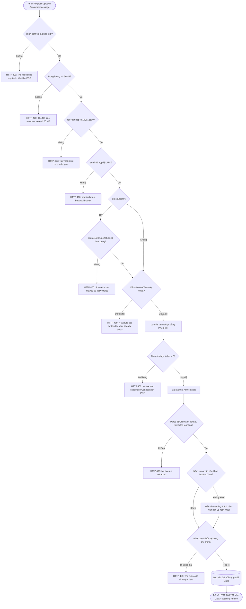

# TÀI LIỆU ĐẶC TẢ CHI TIẾT CÁC CƠ CHẾ VALIDATION (THẨM ĐỊNH DỮ LIỆU)
## PHÂN HỆ: UPLOAD VĂN BẢN QUY TẮC THUẾ & TRÍCH XUẤT TỰ ĐỘNG BẰNG AI (TAX RULE AI EXTRACTION)

**Dự án:** TaxKeep VN - Dịch vụ Trí tuệ Nhân tạo Hỗ trợ Thuế TNCN (`TaxAIService`)  
**Tài liệu tham chiếu:** Trích xuất trực tiếp từ mã nguồn triển khai (`src code`)  
**Phiên bản:** 1.0  
**Ngày cập nhật:** 22/09/2026  

---

### MỤC LỤC
1. [TỔNG QUAN KIẾN TRÚC THẨM ĐỊNH ĐA TẦNG (MULTI-LAYERED DEFENSE)](#1-tổng-quan-kiến-trúc-thẩm-định-đa-tầng)
2. [SƠ ĐỒ LUỒNG KIỂM TRA DỮ LIỆU (VALIDATION FLOW)](#2-sơ-đồ-luồng-kiểm-tra-dữ-liệu)
3. [CHI TIẾT CÁC TẦNG VALIDATION TRONG MÃ NGUỒN](#3-chi-tiết-các-tầng-validation-trong-mã-nguồn)
   - [Tầng 1: API Router / HTTP Form-data Validation](#tầng-1-api-router--http-form-data-validation)
   - [Tầng 2: URL Whitelist & Security Validation](#tầng-2-url-whitelist--security-validation)
   - [Tầng 3: Tệp tin PDF & PyMuPDF Parsing Validation](#tầng-3-tệp-tin-pdf--pymupdf-parsing-validation)
   - [Tầng 4: Logic Nghiệp vụ & Xung đột CSDL (Database Conflict)](#tầng-4-logic-nghiệp-vụ--xung-đột-csdl-database-conflict)
   - [Tầng 5: AI LLM Output & Đối soát Năm thuế (Verification Protocol)](#tầng-5-ai-llm-output--đối-soát-năm-thuế-verification-protocol)
   - [Tầng 6: Vòng đời Dữ liệu & Tính Bất biến (Immutability & Lifecycle)](#tầng-6-vòng-đời-dữ-liệu--tính-bất-biến-immutability--lifecycle)
   - [Tầng 7: Pydantic Schema & Enum Type-Safety Validation](#tầng-7-pydantic-schema--enum-type-safety-validation)
   - [Tầng 8: RabbitMQ Background Worker Input Validation](#tầng-8-rabbitmq-background-worker-input-validation)
4. [BẢNG MA TRẬN VALIDATION TỔNG HỢP (COMPREHENSIVE MATRIX)](#4-bảng-ma-trận-validation-tổng-hợp)
5. [DANH MỤC MÃ LỖI & THÔNG ĐIỆP CHUẨN HÓA](#5-danh-mục-mã-lỗi--thông-điệp-chuẩn-hóa)

---

### 1. TỔNG QUAN KIẾN TRÚC THẨM ĐỊNH ĐA TẦNG

Toàn bộ quy trình từ tiếp nhận tài liệu văn bản luật thuế PDF, bóc tách bằng AI Gemini cho tới ghi nhận vào cơ sở dữ liệu và quản lý vòng đời (hiệu chỉnh/phê duyệt) được bảo vệ bởi **mô hình kiểm soát đa tầng (Multi-layered Defense)**:

```
[Client / FE / Admin Portal / RabbitMQ Queue]
                       │
                       ▼
┌────────────────────────────────────────────────────────┐
│ TẦNG 1: HTTP Request / Router Validation               │  --> Chặn định dạng, dung lượng, UUID, kiểu dữ liệu
└──────────────────────┬─────────────────────────────────┘
                       │
                       ▼
┌────────────────────────────────────────────────────────┐
│ TẦNG 2: URL Whitelist & Domain Security Service        │  --> Chặn URL không hợp lệ, URL nằm ngoài whitelist
└──────────────────────┬─────────────────────────────────┘
                       │
                       ▼
┌────────────────────────────────────────────────────────┐
│ TẦNG 3: PDF Physical Integrity & Parsing (PyMuPDF)     │  --> Chặn file hỏng, file rỗng, phát hiện file scan
└──────────────────────┬─────────────────────────────────┘
                       │
                       ▼
┌────────────────────────────────────────────────────────┐
│ TẦNG 4: Business Logic Pre-check (Database Conflict)   │  --> Chặn trùng lặp tax_year trước khi tốn token AI
└──────────────────────┬─────────────────────────────────┘
                       │
                       ▼
┌────────────────────────────────────────────────────────┐
│ TẦNG 5: AI LLM Output Parsing & Year Verification      │  --> Phân tích JSON, cảnh báo lệch năm thuế (Warning)
└──────────────────────┬─────────────────────────────────┘
                       │
                       ▼
┌────────────────────────────────────────────────────────┐
│ TẦNG 4 (Tiếp): Rule Code Uniqueness Check (DB)         │  --> Chặn trùng lặp rule_code trước khi INSERT
└──────────────────────┬─────────────────────────────────┘
                       │
                       ▼
┌────────────────────────────────────────────────────────┐
│ TẦNG 6: Lifecycle & Immutability (Update/Approve)      │  --> Cấm sửa rule đã Active, kiểm soát đổi năm áp dụng
└──────────────────────┬─────────────────────────────────┘
                       │
                       ▼
┌────────────────────────────────────────────────────────┐
│ TẦNG 7: Pydantic Schema & Enums Type-Safety            │  --> Kiểm soát Enum chuẩn hóa TaxRuleType, DependentType
└────────────────────────────────────────────────────────┘
```

---

### 2. SƠ ĐỒ LUỒNG KIỂM TRA DỮ LIỆU



---

### 3. CHI TIẾT CÁC TẦNG VALIDATION TRONG MÃ NGUỒN

#### Tầng 1: API Router / HTTP Form-data Validation
* **Tập tin:** `app/api/routes/tax_rule/tax_rule_routes.py`
* **Vị trí hàm:** `upload_and_extract_tax_rules` (Dòng 49 - 135)

| STT | Trường kiểm tra | Điều kiện kiểm tra trong mã nguồn | Phản hồi lỗi HTTP | Chi tiết thông báo lỗi |
| :---: | :--- | :--- | :---: | :--- |
| 1.1 | `file` | `if file is None or not file.filename:` | `400 Bad Request` | `{"message": "The file field is required."}` |
| 1.2 | `file.filename` | `if not file.filename.lower().endswith(".pdf"):` | `400 Bad Request` | `{"message": "The file must be a PDF."}` |
| 1.3 | `taxYear` | `if taxYear is None or str(taxYear).strip() == "":` | `400 Bad Request` | `{"TaxYear": "The TaxYear field is required."}` |
| 1.4 | `taxYear` | `int(str(taxYear).strip())` ném `ValueError` hoặc `tax_year_int < 1900 or tax_year_int > 2100:` | `400 Bad Request` | `{"message": "Tax year must be a valid year."}` |
| 1.5 | `adminId` | Có truyền nhưng `uuid.UUID(str(adminId).strip())` thất bại | `400 Bad Request` | `{"message": "adminId must be a valid UUID."}` |
| 1.6 | `file_bytes` | `len(file_bytes) > settings.MAX_FILE_SIZE_MB * 1024 * 1024` (20MB) | `400 Bad Request` | `{"message": "The file size must not exceed 20 MB."}` |
| 1.7 | `sourceUrl` | Có truyền và kiểm tra qua `url_service.validate_url(sourceUrl)` trả về `False` | `400 Bad Request` | `{"SourceUrl": err_msg or "The SourceUrl is not allowed by active URL validation rules."}` |

---

#### Tầng 2: URL Whitelist & Security Validation
* **Tập tin:** `app/services/url_rule/url_validation_service.py`
* **Vị trí hàm:** `validate_url` (Dòng 21 - 60)

| STT | Ràng buộc kiểm tra | Đoạn mã thẩm định | Kết quả | Lý do / Thông báo lỗi |
| :---: | :--- | :--- | :---: | :--- |
| 2.1 | URL không được rỗng | `if not url or not url.strip():` | `False` | `"URL không được để trống."` |
| 2.2 | Scheme & Network Location | `if parsed.scheme not in ("http", "https") or not parsed.netloc:` | `False` | `"URL không đúng định dạng (phải bắt đầu bằng http:// hoặc https://)."` |
| 2.3 | Domain Whitelist | Chuẩn hóa `hostname` (loại bỏ `www.`, chuyển chữ thường) và so khớp với danh sách URL Rules có `is_active=True` trong DB (`hostname == target_domain or hostname.endswith("." + target_domain)`). | `False` | `"URL nguồn không thuộc danh sách tên miền/nguồn được phê duyệt trong hệ thống."` |

---

#### Tầng 3: Tệp tin PDF & PyMuPDF Parsing Validation
* **Tập tin:** `app/services/tax_rule/pdf_service.py`
* **Vị trí hàm:** `prepare_pdf_for_ai` (Dòng 18 - 46)

| STT | Kiểm tra kỹ thuật | Điều kiện trong mã nguồn | Xử lý ngoại lệ |
| :---: | :--- | :--- | :--- |
| 3.1 | Tồn tại tệp tin trên disk | `if not os.path.exists(file_path):` | Ném `PDFProcessingError(detail=PDFErrorMessages.FILE_NOT_FOUND)` |
| 3.2 | Khả năng mở tệp PDF | `doc = pymupdf.open(file_path)` ném ngoại lệ | Ném `PDFProcessingError(detail=PDFErrorMessages.cannot_open_pdf(str(e)))` |
| 3.3 | File PDF rỗng / không nội dung | `if len(doc) == 0:` | Ném `PDFProcessingError(detail=PDFErrorMessages.NO_EXTRACTABLE_TEXT)` |
| 3.4 | Nhận diện văn bản scan | `len(page.get_text("text").strip()) < 15` trên từng trang | Nếu $\ge 50\%$ số trang bị scan, hệ thống bật cờ `is_scanned=True` và chỉ trích xuất tối đa 30 trang tài liệu (`max_scan_pages=30`) để tránh tràn tải bộ nhớ/token. |

---

#### Tầng 4: Logic Nghiệp vụ & Xung đột CSDL (Database Conflict)
* **Tập tin:** `app/services/tax_rule/tax_rule_document_service.py` (Dòng 62 - 113) & `app/repositories/tax_rule/tax_rule_repository.py` (Dòng 50 - 54)

| STT | Nghiệp vụ kiểm tra | Mã nguồn thực thi | Kết quả vi phạm |
| :---: | :--- | :--- | :--- |
| 4.1 | **Kiểm tra trùng năm tính thuế (Pre-check):** Thực hiện trước khi gọi AI để tiết kiệm chi phí/token | `existing_rule_set = self.repository.get_rule_set_by_year(tax_year)`<br>`if existing_rule_set:` | `409 Conflict`: `TaxRuleErrorMessages.TAX_RULE_SET_EXISTS`<br>(*"A tax rule set for this tax year already exists."*) |
| 4.2 | **Bọc lỗi phân tích PDF:** | `except PDFProcessingError:` | `400 Bad Request`: `TaxRuleErrorMessages.NO_TAX_RULE_EXTRACTED` |
| 4.3 | **Kiểm tra trùng lặp mã quy tắc (`ruleCode`):** Quét các `ruleCode` mà AI vừa bóc tách so với toàn bộ bảng `tax_rules` | `rule_codes = [r["ruleCode"] for r in ...]`<br>`if rule_codes and self.repository.check_existing_rule_codes(rule_codes):` | `409 Conflict`: `"The rule code already exists."` |
| 4.4 | **Dọn dẹp tài nguyên tệp tạm:** | Khối `finally:` luôn gọi `os.remove(temp_file_path)` | Đảm bảo không bao giờ để rò rỉ file tạm trên ổ đĩa. |

---

#### Tầng 5: AI LLM Output & Đối soát Năm thuế (Verification Protocol)
* **Tập tin:** `app/services/tax_rule/tax_rule_extraction_service.py` (Dòng 35 - 141)

| STT | Kiểm tra thẩm định AI | Đoạn mã kiểm tra | Xử lý vi phạm |
| :---: | :--- | :--- | :--- |
| 5.1 | Dữ liệu đầu vào AI | `if not document_text and not pdf_bytes:` | Ném `TaxRuleExtractionError` (`400 Bad Request`) |
| 5.2 | Khử định dạng Markdown & Parse JSON | Tự động loại bỏ ` ```json ... ``` ` và có cơ chế fallback tìm cặp ngoặc `{ ... }` | Nếu JSON không thể parse $\rightarrow$ ném `TaxRuleExtractionError` (`400 Bad Request`) |
| 5.3 | Cấu trúc Object gốc | `if not isinstance(data, dict):` | Ném `TaxRuleExtractionError` (`400 Bad Request`) |
| 5.4 | Cấu trúc mảng Tax Rules | `tax_rules = data.get("taxRules", [])`<br>`if not isinstance(tax_rules, list):` | Ném `TaxRuleExtractionError` (`400 Bad Request`) |
| 5.5 | **Đối soát năm tính thuế (Tax Year Cross-check):** | So sánh giữa `tax_year` người dùng nhập và `verification.extractedTaxYear` do AI đọc trong văn bản | **Non-blocking Policy:** Nếu `isTaxYearMatched == False` hoặc năm bóc tách khác `tax_year`, hệ thống tạo `warningMessage` chi tiết và **vẫn cho phép lưu trữ bản nháp (Draft)** để Admin hiệu chỉnh lại. |
| 5.6 | Danh sách quy tắc rỗng | `if not valid_rules:`<br>(khi không có warning lệch năm) | Ném `TaxRuleExtractionError` (`400 Bad Request`) |

---

#### Tầng 6: Vòng đời Dữ liệu & Tính Bất biến (Immutability & Lifecycle)
* **Tập tin:** `app/services/tax_rule/tax_rule_service.py` (Dòng 98 - 173)

| Thao tác | Điểm kiểm tra nghiệp vụ | Điều kiện trong mã nguồn | Mã lỗi & Thông báo |
| :---: | :--- | :--- | :--- |
| **Chi tiết / Sửa / Duyệt** | Kiểm tra sự tồn tại của bộ quy tắc thuế | `result = self.repository.get_tax_rule_set_detail(...)`<br>`if not result:` | `404 Not Found`: `TaxRuleErrorMessages.RULE_SET_NOT_FOUND` |
| **Cập nhật (`PUT`)** | **Tính bất biến của bộ luật đã Active:** Nghiêm cấm chỉnh sửa bất kỳ trường nào khi bộ luật đã được phê duyệt | `curr_rule_set = existing_detail[0]`<br>`if curr_rule_set.status == TaxRuleStatus.ACTIVE.value:` | `400 Bad Request`: `TaxRuleErrorMessages.CANNOT_UPDATE_ACTIVE_RULE_SET` |
| **Cập nhật (`PUT`)** | **Kiểm tra trùng năm khi thay đổi `tax_year`:** Năm mới không được trùng với bất kỳ `TaxRuleSet` nào khác | `if new_tax_year is not None and new_tax_year != curr_rule_set.tax_year:`<br>`conflict_set = self.repository.get_rule_set_by_year(new_tax_year)`<br>`if conflict_set and conflict_set.rule_set_id != rule_set_id:` | `409 Conflict`: `TaxRuleErrorMessages.TAX_RULE_SET_EXISTS` |
| **Phê duyệt (`POST /approve`)** | Chuyển đổi trạng thái từ `Draft` sang `Active` | Ghi nhận định danh người duyệt `approved_by` và thời gian duyệt `approved_at` | `200 OK` (Cập nhật thành công vào CSDL) |

---

#### Tầng 7: Pydantic Schema & Enum Type-Safety Validation
* **Tập tin:** `app/schemas/tax_rule/tax_rule_request.py` & `app/enum/tax_rule_enum.py`

| Schema | Thuộc tính | Kiểu dữ liệu / Enum | Ràng buộc Validation |
| :--- | :--- | :--- | :--- |
| `TaxRuleUploadRequest` | `tax_year` (`taxYear`) | `int` | `ge=1900, le=2100` (Chỉ chấp nhận năm từ 1900 đến 2100). |
| `TaxRuleApproveRequest` | `admin_id` (`adminId`) | `uuid.UUID` | Định dạng chuỗi UUID chuẩn phiên bản RFC 4122. |
| `TaxRuleUpdateRequest` | `tax_year` (`taxYear`) | `Optional[int]` | `ge=1900, le=2100` |
| `TaxRuleItemUpdateRequest` | `rule_type` (`ruleType`) | `Optional[TaxRuleType]` | Thuộc tập hợp: `DEDUCTION`, `EXEMPTION`, `BRACKET`, `EXPENSE_LIMIT`, `FLAT_RATE`. |
| `DependentRuleUpdateRequest` | `dependent_type` (`dependentType`) | `Optional[DependentType]` | Thuộc tập hợp: `CHILD`, `ADULT_CHILD`, `SPOUSE`, `PARENT`, `OTHER`. |
| Các Schema cập nhật | `status` | `Optional[TaxRuleStatus]` | Thuộc tập hợp: `Draft`, `Active`, `Expired`. |

---

#### Tầng 8: RabbitMQ Background Worker Input Validation
* **Tập tin:** `app/messaging/tax_rule/consumer.py` (Dòng 24 - 127)

| STT | Kiểm tra thẩm định thông điệp hàng đợi | Đoạn mã kiểm tra | Xử lý khi vi phạm |
| :---: | :--- | :--- | :--- |
| 8.1 | JSON Body Message | `TaxRuleExtractRequestMessage.model_validate(body_dict)` | Nếu lỗi parse $\rightarrow$ Log error, `message.ack()` và bỏ qua để tránh nghẽn hàng đợi (poison message). |
| 8.2 | Nguồn cung cấp tệp tin (File Resolver) | Hàm `_resolve_file_bytes`: Phải có ít nhất 1 trong 3 trường `fileBase64`, `fileUrl`, hoặc `filePath` | Bắn phản hồi `TaxRuleExtractResponseMessage` với `status="FAILED"` kèm thông báo: `"Request must provide at least one of: fileBase64, fileUrl, or filePath"`. |
| 8.3 | Tải file qua URL (`fileUrl`) | Gọi `httpx.AsyncClient(timeout=60.0)` với `resp.raise_for_status()` | Bắn phản hồi `FAILED` nếu URL không tải được (HTTP 404, 500, timeout). |
| 8.4 | Đọc file đường dẫn local (`filePath`) | `if not os.path.exists(req.file_path):` | Bắn phản hồi `FAILED`: `"File path not found: ..."` |
| 8.5 | Lỗi nghiệp vụ từ TaxRuleService | `except TaxRuleServiceError as tse:` | Bắn phản hồi `FAILED` với `error_message = tse.message`. |

---

### 4. BẢNG MA TRẬN VALIDATION TỔNG HỢP

| Mã VT | Tầng kiểm tra | Đối tượng kiểm tra | Điều kiện hợp lệ | HTTP / Queue Status | Hành vi (Action) |
| :---: | :--- | :--- | :--- | :---: | :--- |
| **V01** | HTTP Router | `file` | Bắt buộc có tệp tin đính kèm | `400 Bad Request` | **Chặn ngay lập tức (Block)** |
| **V02** | HTTP Router | `file.filename` | Phần mở rộng kết thúc bằng `.pdf` | `400 Bad Request` | **Chặn ngay lập tức (Block)** |
| **V03** | HTTP Router | Dung lượng tệp tin | Tối đa 20MB | `400 Bad Request` | **Chặn ngay lập tức (Block)** |
| **V04** | HTTP Router | `taxYear` | Bắt buộc có, là số nguyên `[1900, 2100]` | `400 Bad Request` | **Chặn ngay lập tức (Block)** |
| **V05** | HTTP Router | `adminId` | Định dạng UUID chuẩn | `400 Bad Request` | **Chặn ngay lập tức (Block)** |
| **V06** | URL Security | `sourceUrl` | Scheme `http/https`, thuộc Whitelist DB | `400 Bad Request` | **Chặn ngay lập tức (Block)** |
| **V07** | PDF Physical | Cấu trúc file | Mở được bằng PyMuPDF, `len(doc) > 0` | `400 Bad Request` | **Chặn ngay lập tức (Block)** |
| **V08** | PDF Physical | Scan detection | Ký tự mỗi trang $< 15$ | Internal Flag | Cắt tối đa 30 trang gửi Vision API |
| **V09** | Business Pre-check | `tax_year` trong DB | Bảng `tax_rule_sets` chưa có `tax_year` | `409 Conflict` | **Chặn ngay trước khi gọi AI** |
| **V10** | AI Extraction | JSON Response | Parse được JSON, `taxRules` là list | `400 Bad Request` | **Chặn ngay lập tức (Block)** |
| **V11** | AI Verification | Năm áp dụng | `extractedTaxYear == tax_year` | `200 OK` (Warning) | **Cho phép lưu Draft (Non-blocking)** |
| **V12** | Database Conflict | `ruleCode` trong DB | Không trùng mã đã có trong `tax_rules` | `409 Conflict` | **Chặn ngay trước khi INSERT** |
| **V13** | Rule Lifecycle | `status == Active` | Không cho phép cập nhật bộ luật đã duyệt | `400 Bad Request` | **Chặn sửa bộ luật Active** |
| **V14** | Rule Lifecycle | Đổi năm khi update | Không trùng với bộ luật khác | `409 Conflict` | **Chặn sửa nếu trùng năm khác** |
| **V15** | Rule Lifecycle | Tồn tại bản ghi | `rule_set_id` tồn tại trong DB | `404 Not Found` | **Báo không tìm thấy** |
| **V16** | Type Safety | Enums | Khớp `TaxRuleType`, `DependentType`, `TaxRuleStatus` | `422 Unprocessable` | **Chặn bởi Pydantic Schema** |
| **V17** | Queue Consumer | Nguồn file | Có ít nhất 1 trong 3 nguồn: base64, url, path | `FAILED` Status | **Gửi phản hồi thất bại về Queue** |

---

### 5. DANH MỤC MÃ LỖI & THÔNG ĐIỆP CHUẨN HÓA

Trích xuất trực tiếp từ các hằng số định nghĩa trong `app/errors/tax_rule_errors.py` và `app/errors/pdf_errors.py`:

```python
class TaxRuleErrorMessages:
    FILE_REQUIRED = "The file field is required."
    FILE_MUST_BE_PDF = "The file must be a PDF."
    FILE_TOO_LARGE = "The file size must not exceed 20 MB."
    TAX_YEAR_REQUIRED = "The TaxYear field is required."
    TAX_YEAR_INVALID = "Tax year must be a valid year."
    ADMIN_ID_INVALID = "adminId must be a valid UUID."
    URL_NOT_ALLOWED = "The SourceUrl is not allowed by active URL validation rules."
    TAX_RULE_SET_EXISTS = "A tax rule set for this tax year already exists."
    RULE_CODE_EXISTS = "The rule code already exists."
    NO_TAX_RULE_EXTRACTED = "No tax rule information could be extracted from the document."
    RULE_SET_NOT_FOUND = "Tax rule set not found."
    CANNOT_UPDATE_ACTIVE_RULE_SET = "Cannot update tax rule set because it has already been approved and is active."

class PDFErrorMessages:
    FILE_NOT_FOUND = "File not found"
    CANNOT_OPEN_PDF = "Cannot open PDF file: {error}"
    NO_EXTRACTABLE_TEXT = "File PDF không chứa trang nào hoặc không đọc được nội dung."
```
